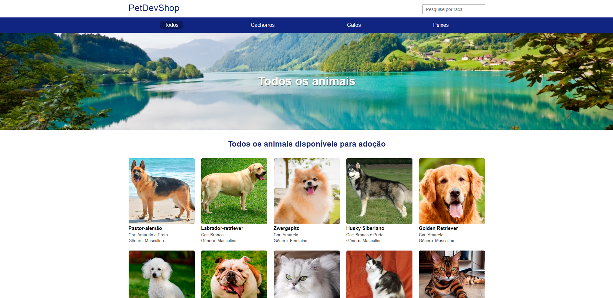

# 📂 PROJETO CANIL
> Frontend da aplicação 📸

  

## 📃 Descrição do projeto
Desenvolvido no módulo do curso Node + Typescript da B7web

 

### Pré-requisitos globais
`npm install -g nodemon typescript ts-node`

## 🛠️ Instalação
`npm install` - Instalar dependências

`npm run start-dev` - Rodar o projeto localmente

---
---
### Relembrando Comandos

`npm init -y` - Cria package.json iniciando npm

`tsc --init` - cria o arquivo de configuração typescript

## Dependências necessárias:

`npm install express mustache-express dotenv`
`npm install --save-dev @types/express @types/mustache-express @types/node`

## Configurações recomendadas:

 `tsconfig.json`

    "target": "es6",
    "module": "commonjs",
    "outDir": "./dist",
    "rootDir": "./src",
    "moduleResolution": "node",

`package.json`

    "scripts": {
      "test": "echo \"Error: no test specified\" && exit 1",
      "start-dev": "nodemon -e ts,json,mustache src/server.ts"
    },

### Configurando Servidor

`src/server.ts`

    import express from 'express';
    import dotenv from 'dotenv';
    import mustache from 'mustache-express';
    import path from 'path';
    import mainRoutes from './routes/index';

    dotenv.config();

    const server = express();

    server.set('view engine', 'mustache');
    server.set('views', path.join(__dirname, 'views'));
    server.engine('mustache', mustache());

    server.use(express.static(path.join(__dirname, '../public')));

    // Rotas
    server.use(mainRoutes);

    server.use((req, res) => {
      res.send('Página não encontrada!');
    });

    server.listen(process.env.PORT);

### Criando rotas e controllers
`src/routes/index.ts`

    import { Router } from 'express';

    const router = Router();

    router.get('/', (req, res) => {
        res.send('home');
    });

    export default router;

Servidor configurado `server.ts`

Rotas configuradas `index.ts`

Controllers configurados `pageController.ts`

### Preparando aplicação para publicar

`npm install --save-dev copyfiles` -

package.json

      "scripts": {
        "start": "node dist/server.js",
        "postinstall": "tsc && copyfiles -u 1 src/**/*.mustache dist/",
        "test": "echo \"Error: no test specified\" && exit 1",
        "start-dev": "nodemon -e ts,json,mustache src/server.ts"
      },
npm install typescript
`npm run postinstall`
